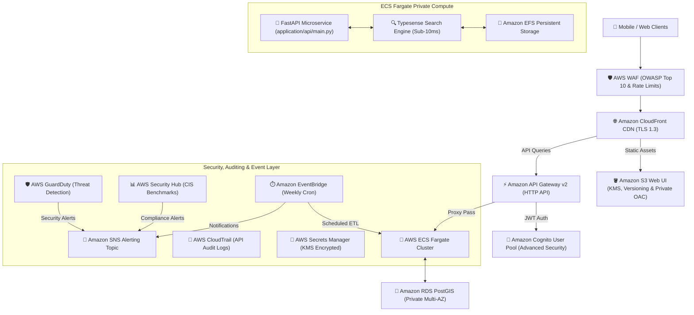

# Crown Corridor — Documentation

> **Real Estate at Your Fingertips** — Next-generation property discovery portal for **Andhra Pradesh & Telangana**.

## Contents

| Document                                                                 | Description                                                                    |
| ------------------------------------------------------------------------ | ------------------------------------------------------------------------------ |
| [index.html](index.html)                                                 | Interactive HTML documentation portal & navigation hub                         |
| [README.md](../README.md)                                                | Repository overview, feature table, and local quickstart                       |
| [user-guide.md](user-guide.md)                                           | A complete guide on how the portal, search, comparison, and audit reports work |
| [framework/README.md](framework/README.md)                               | Open-source IaCSecBench Security Evaluation Framework overview                 |
| [framework/architecture.md](framework/architecture.md)                   | IaCSecBench Framework architecture & pipeline workflow                         |
| [framework/benchmark-methodology.md](framework/benchmark-methodology.md) | Standard evaluation methodology & mathematical metrics                         |
| [architecture.drawio](architecture.drawio)                               | Official AWS Icons Draw.io XML diagram file                                    |
| [graph.png](graph.png) / [graph.svg](graph.svg)                          | Visual Terraform execution plan graph                                          |
| [api/](api/)                                                             | JSDoc API reference for `application/app/portal.js` — generated by CI          |

---

## 🏛️ End-to-End Cloud Infrastructure Architecture



---

## Architecture Overview

```
Browser & Web Portal (application/app/)
  └── application/app/index.html   Dashboard entry point
        ├── styles.css            Glassmorphism dark & light theme design system
        └── portal.js             All portal logic:
              ├── Global Search Real-time API query with debounced autocomplete & local fallback
              ├── Compare Tool  Side-by-side spec comparison modal for up to 3 properties
              ├── SRO Ticker    Live registration feed with pause/resume and speed control
              ├── Map Explorer  Leaflet map + GPS "Locate Me" distance calculation
              ├── Sale History  State-modular registry audit with CAGR analytics & POIs
              ├── Audit Report  One-click printable PDF valuation report generator
              ├── Calculators   Stamp duty (AP 7.5%, TS 6.0%) and guidance-value estimator
              └── API Console   JSON query sandbox and webhook configuration

Fast-Read API & Search Service (application/api/)
  ├── application/api/main.py     Async FastAPI endpoints (/health, /api/v1/search, /api/v1/properties)
  └── application/api/search.py   Typesense connection pool manager & multi-field query builder

Terraform Infrastructure as Code (infrastructure/)
  ├── providers.tf         Terraform >= 1.15.0 & AWS provider ~> 6.56.0 constraint
  ├── main.tf              Master orchestrator connecting 10 child modules
  ├── variables.tf / outputs.tf Root inputs and exported endpoint URLs
  ├── tests/               Centralized Native .tftest.hcl test directory (11 suites, 100% coverage)
  └── modules/             Reusable child modules (vpc, security, waf, cdn, auth, api_gateway, compute, database, secrets_ssm, events_alerting)

IaCSecBench Security Framework (security_framework/)
  ├── engine/engine.py            Core IaC secret scanner & CIS AWS policy validator
  ├── engine/comparative_eval.py  Comparative benchmark evaluator against Checkov, tfsec, Sentinel, Terratest
  ├── policies/                   OPA Rego policy definitions
  └── tests/                      Framework unit test suite (100% accuracy)

Benchmark Datasets & Reports (benchmark/)
  ├── datasets/benchmarks.json    Public benchmark dataset schema
  ├── scenarios/                  Annotated security test case scenarios
  └── reports/                    Telemetry output files (experiment_results.json)

Experiments & Results (experiments/ & results/)
  ├── experiments/run_all.sh      One-command reproducible experiment suite
  ├── experiments/generate_charts.py Benchmark performance chart generator
  └── results/                    metrics.csv, benchmark_results.json & ASCII charts

GitHub Workflows & Governance (.github/workflows/)
  ├── ci.yml              PR gate: ESLint + Prettier + Ruff + Zero-PII check + pytest suite + IaCSecBench harness
  ├── infra-ci.yml        Infra PR gate: terraform fmt/validate/test + Conftest OPA Rego policy + validate_iac.py + pytest
  ├── deploy-pages.yml    Builds _site/ (application/app/ + data/ + docs/) → GitHub Pages with zero-PII data validation
  ├── update-data.yml     Weekly SRO data refresh with --generate-history
  ├── release-please.yml  Automated release PR, versioning & artifact publishing
  ├── uptime-check.yml    Synthetic health & dataset availability check every 6 hours
  └── docs.yml            JSDoc compilation verification on PRs
```
